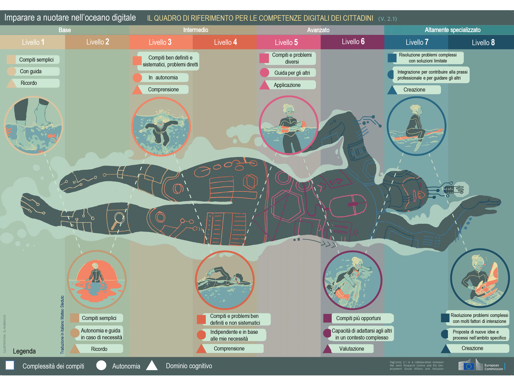
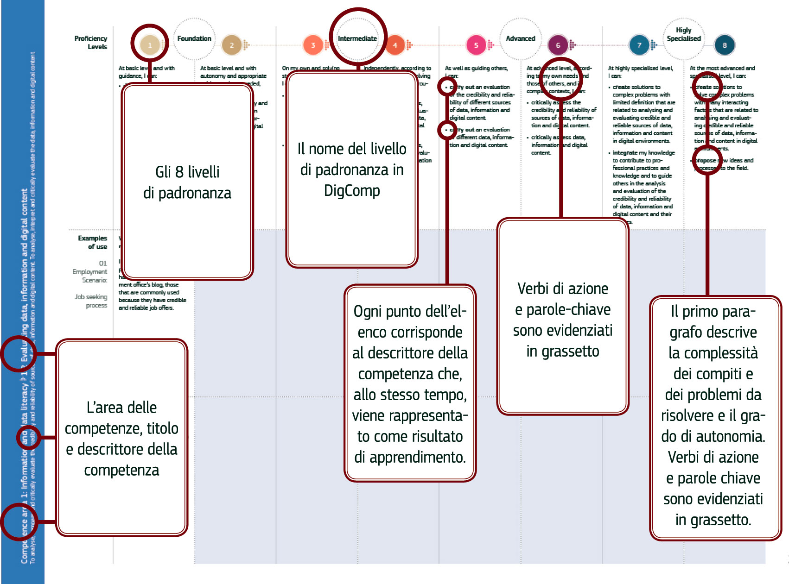

Sezione 2 - Gli otto livelli di padronanza e gli esempi di utilizzo
===================================================================

Il framework DigComp 1.0 aveva tre livelli di padronanza nella
Dimensione 3 (base, intermedio e avanzato). In DigComp 2.1 i livelli
sono stati aumentati a **otto**. Una gamma più ampia e più dettagliata
di livelli di rilevanza supporta lo sviluppo dei materiali di
apprendimento e formazione. Inoltre aiuta nella progettazione di
strumenti per la valutazione dello sviluppo delle competenze dei
cittadini, la guida alla carriera e la promozione sul lavoro.

Gli otto livelli di padronanza per ciascuna competenza sono stati
definiti attraverso i risultati di apprendimento (tramite verbi di
azione, secondo la tassonomia di Bloom) traendo ispirazione dalla
struttura e dal vocabolario del quadro europeo delle qualifiche EQF
(European Qualification Framework). Inoltre, ciascun livello di
descrizione contiene conoscenze, abilità e attitudini racchiuse in un
unico descrittore per ciascun livello di competenza, per un totale di
168 descrittori (8 x 21 risultati di apprendimento). La prima versione
dei livelli è stata rivista alla luce degli esiti di un sondaggio di
validazione online ed è stata prodotta la versione finale.

Come mostra la tabella 1, ciascun livello rappresenta un gradino in più
nell’acquisizione da parte dei cittadini delle competenze in base alla
sfida cognitiva, alla complessità delle attività che possono gestire e
alla loro autonomia nello svolgimento dell’attività. Per illustrare
questo punto si può affermare che un cittadino di livello 2 è in grado
di ricordare e svolgere un compito semplice aiutato da qualcuno con
competenze digitali solo in caso di necessità. Un cittadino di livello
5, invece, può applicare le conoscenze, svolgere diversi compiti e
risolvere i problemi, oltre che aiutare gli altri a farlo. Come possiamo
vedere, inoltre, i primi sei livelli di padronanza del nuovo quadro sono
collegati ai tre livelli definiti in origine in DigComp 1.0. All’ultima
versione del quadro di riferimento è stato aggiunto un nuovo livello
altamente specializzato che comprende i livelli sette e otto. Le
informazioni nella Tabella 1 sono state rappresentate nell’infografica.

**Tabella 1: Principali parole chiave che contraddistinguono i livelli di padronanza**

+-------------------------+------------------------+-------------------------------------+-----------------------------------+-------------------+
| Livelli in DigComp 1.0  | Livelli in DigComp 2.1 | Complessità dei compiti             | Autonomia                         | Dominio cognitivo |
+-------------------------+------------------------+-------------------------------------+-----------------------------------+-------------------+
| Base                    | 1                      | Compiti semplici                    | Con guida                         | Ricordo           |
+                         +------------------------+-------------------------------------+-----------------------------------+-------------------+
|                         | 2                      | Compiti semplici                    | Autonomia e guida in caso di      | Ricordo           |
|                         |                        |                                     | necessità                         |                   |
+-------------------------+------------------------+-------------------------------------+-----------------------------------+-------------------+
| Intermedio              | 3                      | Compiti ben definiti e sistematici, | In autonomia                      | Comprensione      |
|                         |                        | problemi diretti                    |                                   |                   |
+                         +------------------------+-------------------------------------+-----------------------------------+-------------------+
|                         | 4                      | Compiti e problemi ben definiti e   | Indipendente e in                 | Comprensione      |
|                         |                        | non sistemaitici                    | base alle mie necessità           |                   |
+-------------------------+------------------------+-------------------------------------+-----------------------------------+-------------------+
| Avanzato                | 5                      | Compiti e problemi diversi          | Guida per gli altri               | Applicazione      |
+                         +------------------------+-------------------------------------+-----------------------------------+-------------------+
|                         | 6                      | Compiti più opportuni               | Capacità di adattarsi agli altri  | Valutazione       |
|                         |                        |                                     | in un contesto complesso          |                   |
+-------------------------+------------------------+-------------------------------------+-----------------------------------+-------------------+
| Altamente specializzato | 7                      | Risoluzione di problemi complessi   | Integrazione per contribuire      | Creazione         |
|                         |                        | con soluzioni limitate              | alla prassi professionale e       |                   |
|                         |                        |                                     | per guidare gli altri             |                   |
+                         +------------------------+-------------------------------------+-----------------------------------+-------------------+
|                         | 8                      | Risoluzione di problemi complessi   | Proposta di nuove idee e processi | Creazione         |
|                         |                        | con molti fattori di interazione    | nell'ambito specifico             |                   |
+-------------------------+------------------------+-------------------------------------+-----------------------------------+-------------------+

La Figura 1 fornisce una spiegazione dettagliata di come le competenze vengono presentate nella Sezione 3 di questo rapporto.

-  **Le Aree delle competenze** (dimensione 1) e il rispettivo **Titolo
   delle competenze** e il **Descrittore delle competenze** (dimensione
   2) compaiono nella banda verticale, il cui colore, nella versione PDF
   del documento, cambia in funzione dell’area di competenza.

-  La prima riga mostra i nomi degli **8 Livelli di padronanza**
   (dimensione 3) secondo la versione 2.1 (livello 1, livello 2, ecc).
   In parallelo, viene riportato il nome dei livelli secondo DigComp 1.0
   (base, intermedio, ecc.).

-  Nella seconda riga si può leggere la descrizione per ciascun livello
   di padronanza relativamente alla complessità dei compiti e ai
   problemi e il livello di autonomia, oltre alla descrizione della
   competenza in termini di risultati di apprendimento. Ciascun punto
   corrisponde a un descrittore di competenza, mentre i rispettivi verbi
   di azione e le parole chiave sono riportati in grassetto.

**Figura 1: Spiegazione di come vengono presentate le competenze**

Anche gli **esempi di utilizzo** (dimensione 5 del quadro di
riferimento) sono stati aggiornati e contestualizzati all’interno degli
scenari in due aree di utilizzo: **occupazione e apprendimento**. Questi
illustrano gli otto livelli di padronanza per favorire la futura
implementazione di DigComp 2.1.

Come mostra la Sezione 3 del rapporto, gli esempi di utilizzo sono
presentati come segue:

-  Sono stati inclusi esempi di livelli di padronanza per due aree di
   utilizzo: occupazione e apprendimento.

-  Sono stati inclusi scenari per ciascuna area di competenze e area di
   utilizzo allo scopo di contestualizzare gli esempi.

-  Sono stati elaborati esempi per queste due aree di utilizzo per
   ciascun livello di padronanza. In questa versione 2.1, gli esempi per
   gli 8 livelli sono disponibili solo nella prima competenza (1.1), per
   le restanti viene fornito un solo esempio per livello e area di
   utilizzo [2]_.

Allo scopo di fornire esempi per lo stesso numero di livelli di
padronanza e per avere lo stesso numero di esempi tra i livelli, abbiamo
seguito una strategia a “cascata”: per una competenza abbiamo scritto
gli esempi per un livello e in quella successiva abbiamo scritto
l’esempio nel livello successivo, ecc. Ad esempio, le competenze 1.1 e
1.2 hanno un esempio per il livello 1, la competenza 1.3 per il livello
2 e la competenza 1.4 per il livello 3, ecc.

Nella versione PDF sono state utilizzate le strisce a fumetti allo scopo
di mostrare un esempio di utilizzo per uno scenario di occupazione e un
esempio di utilizzo per uno scenario di apprendimento per la competenza
1.1.

La striscia a fumetti presente nella versione PDF consente al lettore di
comprendere in modo facile e concreto i progressi compiuti
nell’acquisizione della competenza digitale per supportare gli
stakeholder desiderosi di implementare il quadro di riferimento.

Esempio di utilizzo: competenza 1.1
===================================

1.1 Navigare, ricercare e filtrare dati, informazioni e contenuti digitali
--------------------------------------------------------------------------

Articolare i fabbisogni informativi, ricercare i dati, le informazioni e
i contenuti in ambienti digitali, accedervi e navigare al loro interno.
Creare e aggiornare strategie di ricerca personali.

Livelli di padronanza
---------------------

1 - Base
''''''''

A livello base e con l’aiuto di qualcuno, sono in grado di:

-  **individuare** i miei fabbisogni informativi,

-  **trovare** dati, informazioni e contenuti attraverso una semplice
   ricerca in ambienti digitali,

-  **scoprire** come accedere a questi dati, informazioni e contenuti e
   navigare al loro interno,

-  **identificare semplici** strategie di ricerca personali.

Esempi di utilizzo
******************
*01 – Scenario di occupazione: Processo di ricerca di un lavoro*
****************************************************************

Con l’aiuto di un consulente per il lavoro:

Sono in grado di individuare, all’interno di un elenco, i portali che
possono aiutarmi a trovare lavoro.

Inoltre, sono in grado di trovare questi portali nell’app store dal mio
smartphone e navigare al loro interno.

Sono in grado di individuare le parole chiave utili per me da un elenco
di parole generiche per la ricerca di lavoro in un blog specializzato.

*02 – Scenario di apprendimento: Preparare una breve relazione su un argomento specifico*
*****************************************************************************************

Con l’aiuto di un insegnante:

Sono in grado di identificare siti web, blog e database digitali da un
elenco nel mio libro di testo digitale per cercare riferimenti
bibliografici sull’argomento della relazione.

Sono inoltre in grado di individuare riferimenti bibliografici
sull’argomento della relazione in questi siti web, blog e database
digitali, oltre ad accedervi e a navigare al loro interno.

Utilizzando un elenco di parole chiave ed etichette generiche
disponibili nel mio libro di testo digitale, sono inoltre in grado di
individuare quelle che potrebbero essere utili per trovare riferimenti
bibliografici sull’argomento della relazione.

2 - Base
''''''''

A livello base, in autonomia e con un supporto adeguato, laddove
necessario,

sono in grado di:

-  **individuare** i miei fabbisogni informativi,

-  **trovare** dati, informazioni e contenuti attraverso una semplice
   ricerca in ambienti digitali,

-  **scoprire** come accedere a questi dati, informazioni e contenuti e
   navigare al loro interno,

-  **identificare semplici** strategie di ricerca personali.

Esempi di utilizzo
******************

*01 – Scenario di occupazione: Processo di ricerca di un lavoro*
****************************************************************

Con l’aiuto, se necessario, di un consulente per il lavoro:

Sono in grado di individuare, all’interno di un elenco, i portali che
possono aiutarmi a trovare lavoro.

Inoltre, sono in grado di trovare questi portali nell’app store dal mio
smartphone e navigare al loro interno.

Sono in grado di individuare le parole chiave utili per me da un elenco
di parole generiche per la ricerca di lavoro in un blog specializzato.

*02 – Scenario di apprendimento: Preparare una breve relazione su un argomento specifico*
*****************************************************************************************

In classe con il mio insegnante che posso consultare ogni volta che ho bisogno di:

Sono in grado di identificare siti web, blog e database digitali da un
elenco nel mio libro di testo digitale per cercare riferimenti
bibliografici sull’argomento della relazione.

Sono inoltre in grado di individuare riferimenti bibliografici
sull’argomento della relazione in questi siti web, blog e database
digitali, oltre ad accedervi e a navigare al loro interno.

Utilizzando un elenco di parole chiave ed etichette generiche
disponibili nel mio libro di testo digitale, sono inoltre in grado di
individuare quelle che potrebbero essere utili per trovare riferimenti
bibliografici sull’argomento della relazione.

3- Intermedio
'''''''''''''

Da solo e risolvendo problemi diretti, sono in grado di:

-  **spiegare** i miei fabbisogni informativi,

-  **svolgere ricerche ben definite e di routine** per individuare dati,
   informazioni e contenuti negli ambienti digitali,

-  **spiegare** come accedervi e navigare al loro interno,

-  **spiegare** strategie personali di ricerca **ben definite e
   sistematiche**.

Esempi di utilizzo
******************

*01 – Scenario di occupazione: Processo di ricerca di un lavoro*
****************************************************************

Da solo:

Posso indicare i portali di lavoro che uso abitualmente per aiutarmi a
cercare un lavoro.

Posso utilizzare parole chiave ben definite per trovare portali di
lavoro nell'app store del mio smartphone e spiegare al consulente per
l'impiego come accedo e navigo tra loro.

Posso spiegare al consulente del lavoro perché di solito uso determinate
parole chiave per trovare portali e app di lavoro nel mio smartphone.

Posso risolvere problemi come accedere al portale o all'app di lavoro
sbagliati o navigare lontano dai portali che uso abitualmente.

*02 – Scenario di apprendimento: Preparare una breve relazione su un argomento specifico*
*****************************************************************************************

Da solo:

Posso indicare al mio insegnante i siti web, blog e database digitali a
cui accedo abitualmente dal mio computer per consultare la bibliografia
per i miei compiti.

Posso anche utilizzare parole chiave ben definite per trovare risorse
bibliografiche in siti Web, blog e database digitali e spiegare come
accedo e navigo tra i risultati che trovo.

Posso spiegare ai miei compagni di classe quelle parole chiave e i tag
che utilizzo di solito per trovare la bibliografia in ambienti digitali
(blog, siti Web, database) per preparare i compiti.

Posso risolvere problemi come l'identificazione del fatto che ho
visitato il sito Web sbagliato o che sto navigando fuori dai siti Web di
uso comune.

4 - Intermedio
''''''''''''''

In modo indipendente, secondo i miei fabbisogni e risolvendo problemi
ben definiti e non sistematici, sono in grado di:

-  **illustrare** fabbisogni informativi,

-  **organizzare** le ricerche di dati, informazioni e contenuti in
   ambienti digitali,

-  **descrivere** come accedere a questi dati, informazioni e contenuti
   e navigare al loro interno,

-  **organizzare** strategie di ricerca personali.

Esempi di utilizzo
******************

*01 – Scenario di occupazione: Processo di ricerca di un lavoro*
****************************************************************

Posso dare esempi al consulente del lavoro di idonei portali o app di
lavoro che utilizzo per le mie esigenze di ricerca di lavoro.

Sono in grado di organizzare la mia strategia di ricerca, ad esempio
utilizzando parole chiave e verificando la valutazione delle app, al
fine di trovare app idonee sul mio smartphone che si adattino al mio
profilo di ricerca di lavoro.

Posso descrivere al consulente del lavoro come accedo e navigo tra le
app che ho trovato attraverso questa strategia di ricerca organizzata.

Posso organizzare un elenco di parole chiave che sono utili per trovare
portali e app di lavoro con offerte di lavoro relative al mio profilo di
lavoro sul mio smartphone.

Mentre svolgo queste attività, posso risolvere problemi come valutare
nuove app visualizzate nell'app store del mio smartphone come risultato
della mia ricerca o aggiungere nuove parole chiave alla mia strategia di
ricerca personale.

*02 – Scenario di apprendimento: Preparare una breve relazione su un argomento specifico*
*****************************************************************************************

Posso dare esempi ai miei compagni di classe di siti Web, blog e
database digitali che consulto per trovare la bibliografia relativa
all’argomento della mia relazione.

Sono in grado di organizzare la mia strategia di ricerca per trovare qui
siti Web, blog e database digitali contenenti bibliografia correlata
all'argomento della mia relazione.

Posso descrivere al mio insegnante come accedo e navigo tra siti web,
blog e database digitali per trovare la bibliografia che ho ottenuto
attraverso questa ricerca organizzata.

Posso organizzare, con note adesive digitali e online sul mio tablet, un
elenco di parole chiave e tag utili per trovare la bibliografia
correlata all'argomento della mia relazione.

Posso rispondere a qualsiasi problema mentre sto facendo queste
attività. Ad esempio, posso aggiungere nuove parole chiave e tag alle
mie strategie di ricerca personali se non trovo le risorse appropriate
relative all'argomento della mia relazione.

5 – Avanzato
''''''''''''

Oltre a fornire supporto agli altri, sono in grado di:

-  **soddisfare** i fabbisogni informativi,

-  **applicare** ricerche per ottenere dati, informazioni e contenuti in
   ambienti digitali,

-  **mostrare** come accedere a questi dati, informazioni e contenuti e
   navigare al loro interno,

-  **proporre** strategie di ricerca personali.

Esempi di utilizzo
******************

*01 – Scenario di occupazione: Processo di ricerca di un lavoro*
****************************************************************

Quando cerco lavoro, posso trovare portali di lavoro e app relative al
mio profilo di lavoro in qualsiasi ambiente digitale, sia di uso
abituale che nuovi (sistema operativo, app, dispositivi).

Posso mostrare anche ad un’amica come trovare app sul suo smartphone,
utilizzando parole chiave e criteri di valutazione diversi per
selezionare quelli che si adattano al suo profilo di lavoro.

Posso spiegarle come accedere e navigare tra queste app per trovare
offerte di lavoro appropriate.

Posso offrire ad un amico i miei consigli per la ricerca di lavoro
contenenti le principali parole chiave, annunci di lavoro, blog, wiki,
app e portali che uso quando cerco lavoro e lo condivido con altre
persone in cerca di lavoro.

*02 – Scenario di apprendimento: Preparare una breve relazione su un argomento specifico*
*****************************************************************************************

Per preparare la relazione, posso accedere a siti Web, blog e database
digitali per trovare la bibliografia relativa all'argomento, utilizzando
qualsiasi ambiente digitale, di uso comune o nuovi (sistema operativo,
app, dispositivi).

Posso mostrare a una compagna di classe come trovare sul suo tablet,
siti Web, blog e database digitali contenenti la bibliografia per la
relazione.

Posso spiegarle come accedere e navigare tra queste risorse digitali per
trovare la bibliografia per la sua relazione.

Posso offrire ad un amico i miei consigli su come trovo siti Web, blog e
database digitali con materiale informativo correlato alla relazione
utilizzando parole chiave e tag.

6 – Avanzato
''''''''''''

A un livello avanzato, secondo i miei fabbisogni e quelli degli altri,
all’interno di contesti complessi, sono in grado di:

-  **valutare** i fabbisogni informativi,

-  **adeguare** la mia strategia di ricerca per trovare i dati, le
   informazioni e i contenuti **più adatti** all’interno di ambienti
   digitali,

-  **spiegare** come accedere ai dati, alle informazioni e ai contenuti
   **più adatti** e navigare al loro interno,

-  **variare** le strategie di ricerca personali.

Esempi di utilizzo
******************

*01 – Scenario di occupazione: Processo di ricerca di un lavoro*
****************************************************************

Posso valutare i portali di lavoro più appropriati per le offerte di
lavoro in base alle mie esigenze di ricerca di lavoro e per quelle di un
amico.

Riesco a trovare le app di lavoro adatte alle mie esigenze di ricerca di
lavoro e per quelle di un amico. Posso distinguere tra app appropriate e
inappropriate, informazioni pop-up o spam mentre sto accedendo e
navigando tra le app.

Posso spiegare ad altre persone in cerca di lavoro come eseguo queste
ricerche e posso superare le situazioni inaspettate che si presentano
nell'ambiente digitale (spam, portali di lavoro inappropriati, problemi
con il download, ecc.) per trovare offerte di lavoro adeguate sul mio
smartphone.

Posso condividere i miei suggerimenti sulla ricerca di lavoro contenenti
le parole chiave, gli annunci di lavoro, i blog, le wiki, le app e i
portali più adatti ai diversi profili di lavoro e fornire esempi su come
superare situazioni complesse in cerca di lavoro (ad esempio non trovare
annunci di lavoro appropriati, annunci di lavoro falsi o vecchi).

*02 – Scenario di apprendimento: Preparare una breve relazione su un argomento specifico*
*****************************************************************************************

Sono in grado di valutare i siti web, i blog e i database digitali più
appropriati per ottenere la bibliografia in base alle mie esigenze e a
quelle di un amico.

Riesco a trovare siti web, blog e database digitali adattati alle mie
esigenze e a quelle di un amico, e differenziare tra risorse digitali
appropriate e inappropriate, informazioni pop-up o spam mentre vi sto
accedendo e navigando.

Posso spiegare al mio insegnante come eseguo queste ricerche e superare
le situazioni inaspettate che si presentano nell'ambiente digitale (ad
esempio, se hai bisogno di un nome utente per accedere agli archivi di
una biblioteca digitale) per trovare la bibliografia per scrivere la
relazione.

Posso dare consigli che evidenziano la mia strategia personale per
trovare la bibliografia più appropriata in siti Web, blog e database
digitali, compresi esempi su come posso superare le complessità che si
verificano durante la navigazione tra queste risorse digitali (ad
esempio non trovando abbastanza bibliografia, dati di pessima qualità).

7 – Altamente specializzato
'''''''''''''''''''''''''''

A un livello altamente specializzato, sono in grado di:

-  **creare soluzioni per problemi complessi con definizione limitata**
   inerenti la navigazione, la ricerca e l’applicazione di filtri a
   dati, informazioni e contenuti digitali,

-  **integrare** le mie conoscenze **per fornire un contributo alle
   prassi e alle conoscenze professionali e fornire supporto ad altri**
   per navigare, ricercare e filtrare dati, informazioni e contenuti
   digitali.

Esempi di utilizzo
******************

*01 – Scenario di occupazione: Processo di ricerca di un lavoro*
****************************************************************

Posso creare una piattaforma collaborativa digitale (blog, wiki, ecc.)
che può essere utilizzata da altre persone in cerca di lavoro per
cercare e filtrare portali e offerte di lavoro in base alle loro
esigenze di ricerca di lavoro.

*02 – Scenario di apprendimento: Preparare una breve relazione su un argomento specifico*
*****************************************************************************************

Posso creare una piattaforma collaborativa digitale (blog, wiki, ecc.)
nell'ambiente di apprendimento digitale della scuola, condividere e
filtrare la bibliografia che ho trovato utile sull'argomento della
relazione, guidando i miei compagni di classe a scrivere la loro
relazione.

8 – Altamente specializzato
'''''''''''''''''''''''''''

A un livello avanzatissimo e super specializzato, sono in grado di:

-  **creare soluzioni per risolvere problemi complessi con molti fattori
   di interazione** inerenti la navigazione, la ricerca e l’applicazione
   di filtri a dati, informazioni e contenuti digitali,

-  **proporre nuove** idee e processi nell’ambito specifico.

Esempi di utilizzo

*01 – Scenario di occupazione: Processo di ricerca di un lavoro*
****************************************************************

Posso creare nuove app o piattaforme per consultare, cercare e filtrare
portali e offerte di lavoro in base alle esigenze dei richiedenti
lavoro.

*02 – Scenario di apprendimento: Preparare una breve relazione su un argomento specifico*
*****************************************************************************************

Posso sviluppare una nuova app o piattaforma per sfogliare, cercare e
filtrare la bibliografia su argomenti accademici da utilizzare in
classe.

.. [2]
   Il quadro di riferimento, così come gli esempi, hanno puramente
   natura descrittiva pertanto non vengono forniti esempi per tutti i
   livelli di padronanza.
